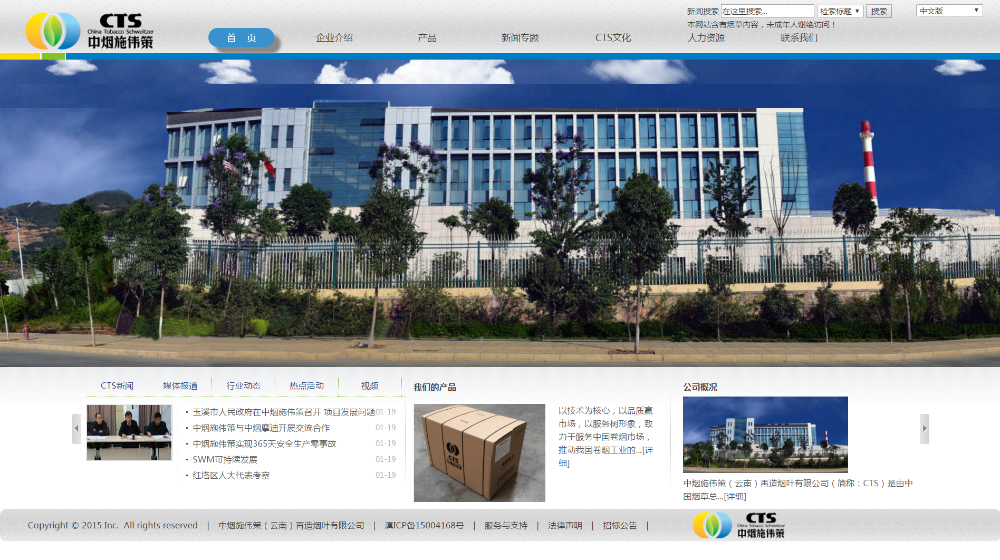
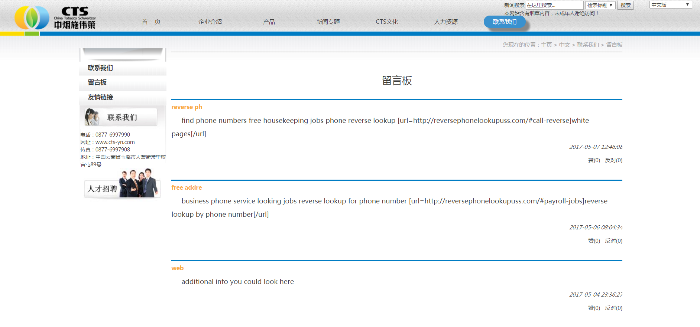
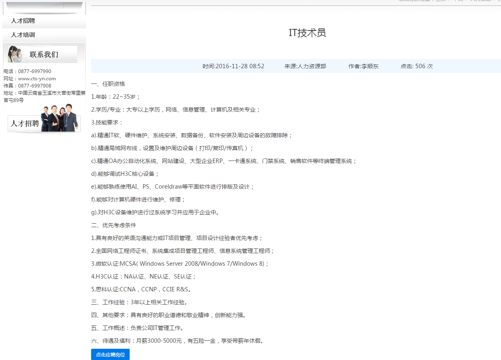
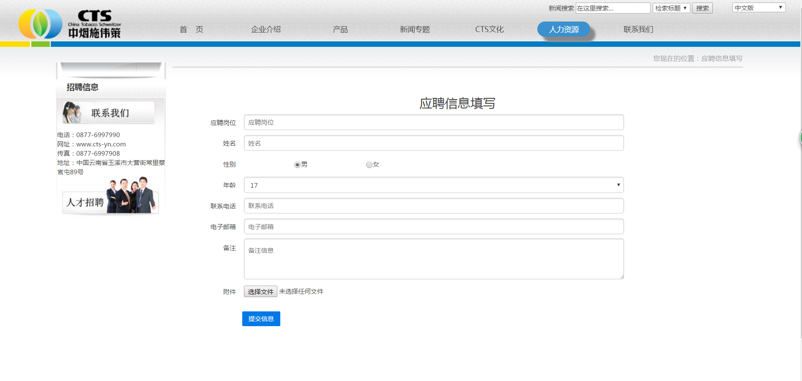
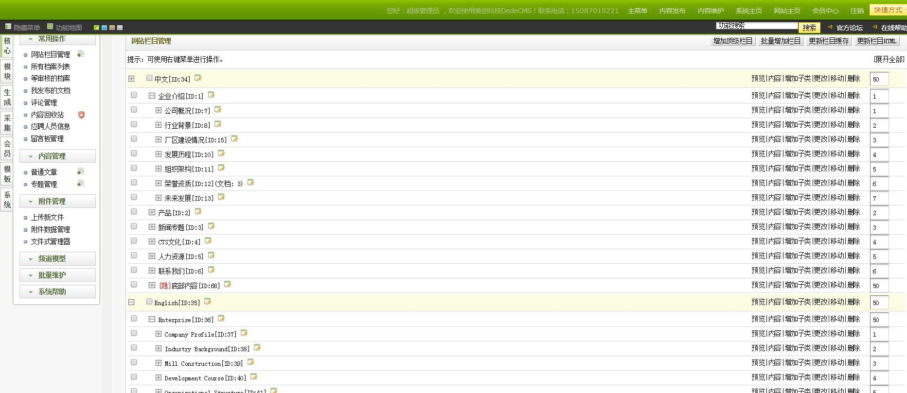
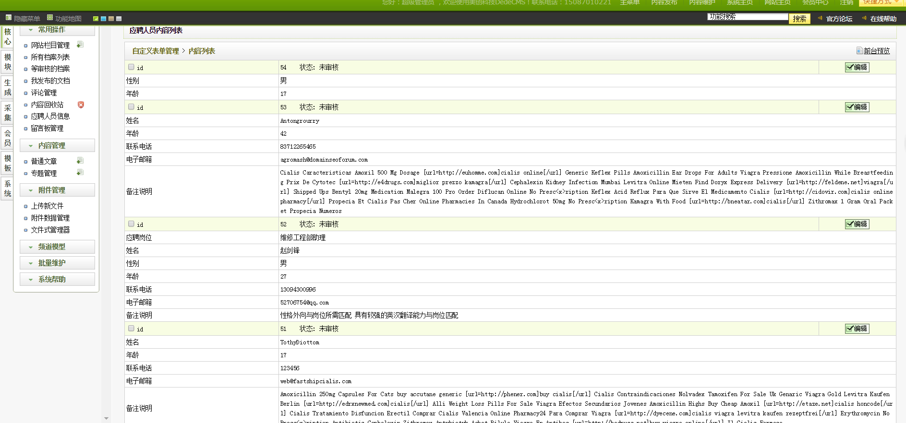
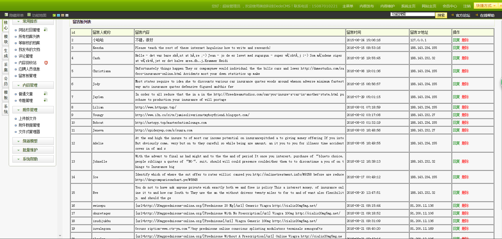

# ctsEnterpriseWebSite
# 一个基于dedeCMS的企业官网
- 基于dede5.7 sp1开发的一套前段模板
- 在基础功能的基础上根据需求增加了一个可以点赞的留言板模块
- 增加了一个招聘投递简历的功能
- 数据库备份在db目录下，导入mysql中
- 项目的数据库访问配置文件在data/common.inc.php中
- 后台管理员账号admin 密码：admin

* 昵称：loserStar 
* email:xinxin321198@gmail.com 
* email2:362527240@qq.com 
* qq:362527240 
* github:https://github.com/xinxin321198 
* 简书主页:http://www.jianshu.com/u/37816485e7e9 